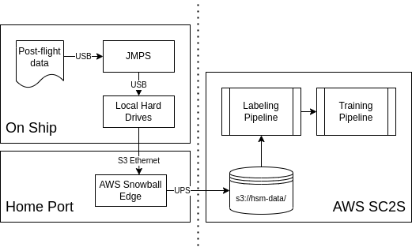

## Who am I?

### Just some pilot

LCDR Alex "Jarvis" Buck

- USNA '11, MIT '13
- MH-60R Seahawk Weapons & Tactics Instructor
- Mostly based from San Diego, C7F + C5F deployments
- Currently at Carrier Air Wing EIGHT in NAS Oceana

### In the right place at the right time

# Project Harbinger+Air

Use machine learning to real-time classify acoustic contact in the spectrogram (*gram*) from an SSQ-53 series DIFAR buoy.

## Needle in a Haystack

$$SE = SL-PL-NL+DI-RD$$

There are lots of things that make sound in the water other than submarines.

Finding and discriminating subsurface contact from other sources is hard.

Doing so, while managing 4 other sensors is harder.

**Let my sensors monitor themselves when I am not.**

# So, where's the data?

## What happens after a flight

### ...It gets deleted

Once any immediate debrief or VI is complete, re-format the cards.

### Except ESM... sometimes

Previously the only mission sensor data collection effort in the MH-60R fleet.

Multiple steps for the aircrew:

  - Run a program to parse ESM data (many steps req.)
  - Find output in obscure folder
  - Manually rename output according to specific format
  - Upload output to IntelDocs

### Well that's not great

## The Mantra

{height=80%}

## Every Byte, Every Flight

### Minimize aircrew actions and decisions.
Save everything, build batch processing on the backside.

Build future value for other sensors, e.g. ISAR, FLIR, etc...

### There are lots of bytes
- ~20 GB/flight-hour^[Depends highly on what sensors are being used and recorded. Ranges from 10 to 30 GB/flight-hour.]
- ~240 GB/flight-day (12-hour fly day)
- ~36 TB/2-bird detachment (150 fly days)
- ~60 TB/CVN element (20-hour fly day, 150 fly days)

### Not enough storage
We needed a better simple storage solution.

<!-- 
## Alone with a Snowball

Harbinger+Air uses AWS Secret Commercial Cloud Services.

AWS Snowball Edge migrates up to 80TB into AWS S3. 

Security Manager: "What the *$%! is this?" 
{height=30%}
{height=30%} 
-->
<!-- 
Arrives unclassified via UPS

Departs classified via prepaid UPS^[DoD Manual 5200.01 Enclosure 4 paragraph 10d]
-->

## Data Pipeline: The fleet side

## Cronus, the harvester

Open source tool^[Source available at [gitlab.gs.mil/hsm/cronus](gitlab.gs.mil/hsm/cronus)] built on JMPS laptops that:

- Minimizes aircrew decisions
- Minimizes aircrew post-flight actions
- Automates connection to AWS Snowball Edge

Its really just a fancy copy/paste operation right now.

Initial version built in 3 weeks. Iterated with users over 4 HARPs throughout 2020 and 2021.

Usage checklist is a single kneeboard sized page.

# Where is the project now?

## Status of Harbinger+Air fleet collections

Data collection process used on **14** operational MH-60R deployments and numerous HARP classes.

Replaced Snowballs on ships with several 10TB hard drives.

Testing initial algorithm later this year on P-8A.

Roadmap to MH-60R integration is unknown.

# What we learned

No community funded systematic collection and organization of sensor datasets. Future of Harbinger+Air data collection is unclear.

To maximize adoption, minimize what the operator needs to learn to support collection.

Data collection can support aircrew training and debrief to encourage adoption.

Long-term Snowball rental is expensive if all you need is storage.^[The first 10 days are free. Intended as dump and ship back.]

Snowballs can fail. Not ideal when stuck on a ship for 6 months.

There is no secret room of data labellers. If possible, use post-flight support personnel or aircrew to label.^[Transcribe aircraft ICS as a first pass at labelling.]

Sandboxed mission system that does not affect flight operations expedites in-aircraft test.^[e.g. Mighty Orion system on P-8A, vice no clear path for MH-60R.]

# Questions